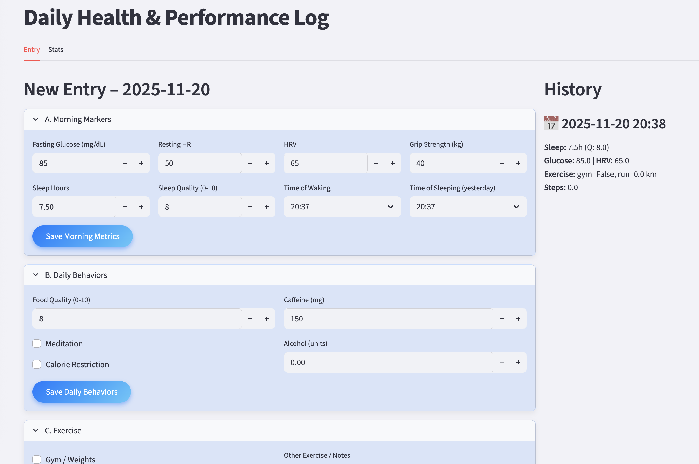

# Wellness Tracker - Know thyself!

A fully configurable daily health & performance logging app built with Streamlit.
All interface elements — inputs, sliders, checkboxes, dropdowns, notes, and multi-column layouts — are automatically generated from a single YAML configuration file (config.yaml).
This makes the system extremely easy to customize without modifying Python code.

---

## Interface Preview

<p align="center">
  
</p>


## Features

### ✔ Fully Configurable via YAML
All UI blocks are defined in `example_config.yaml`:

- Add or remove categories (Morning Metrics, Behaviors, Exercise...)
- Control layout with `n_cols` and `col` assignments  
- Supported field types:
  - `number`
  - `checkbox`
  - `select`
  - `slider`
  - `text`
  - `textarea`
  - `time`
- Customize labels, defaults, ranges, options, etc.

The UI regenerates automatically on every run.

---

### ✔ Partial Daily Updates
The app stores **one row per day**, and each section saves independently:

- Log morning biomarkers early  
- Add exercise during the day  
- Finish with subjective ratings at night  

Each block updates only its fields without touching the rest.

---

### ✔ Local & Private Data Storage
Data is stored locally in:
```
wellness_data.csv
```

---

### ✔ iOS-Style User Interface
A custom theme (`apply_ios_style()` in `style.py`) provides:
 
- Clean card-style blocks  
- Styled sliders, checkboxes, and input fields  
- A minimalistic iOS-like look

---

### ✔ Ideal for Data Analysis
Because both the UI and data schema are defined declaratively:

- CSV structure is consistent  
- Easy to analyze using Python, Pandas, R, Excel, etc.  
- Extendable into dashboards, trend analysis, and ML models  

This is a flexible foundation for building personal analytics.

---

## Installation

1. Make the installer executable:

```bash
chmod +x install.sh
```

2. Run it:

```bash
bash ./install.sh
```
This will:

Create a conda environment "wellness" and install Streamlit, Pandas, PyYAML

## Running the App

1. Make run.sh executable:

```bash
chmod +x run.sh
```

2. Launch the app:

```bash
bash ./run.sh
```

Your browser will open at:

http://localhost:8501


## Customizing the UI

All customization happens in the YAML file:

```yaml
- id: morning
  title: "Morning Metrics"
  n_cols: 4
  fields:
    - name: fasting_glucose
      label: "Fasting Glucose (mg/dL)"
      type: number
      default: 85
      col: 0
```

Add a new field instantly:

```yaml
- name: body_weight
  label: "Body Weight (kg)"
  type: number
  default: 78
  col: 1
```

Restart ./run.sh and the app updates automatically — no Python edits required.

## Project Structure
```bash
├── configs                      # All configuration files (UI/layout presets)
│   ├── config.yaml              # Primary config used by the app (current active layout)
│   └── example_config.yaml      # Example/template config showing how to define blocks/fields
├── data                         # Runtime data storage (git-ignored in most setups)
│   └── wellness_data.csv        # Collected wellness logs (one row per day, updated incrementally)
├── img                          
│   └── wellness-tracker.png     
├── install.sh                   # One-shot installer: creates conda env, installs dependencies
├── main.py                      # Main Streamlit app: loads config, builds UI, handles logic
├── README.md                    
├── run.sh                       # Launcher script: activates env and runs `streamlit run main.py`
└── style.py                     # Styling utilities (e.g., apply_ios_style) for iOS-like look
```